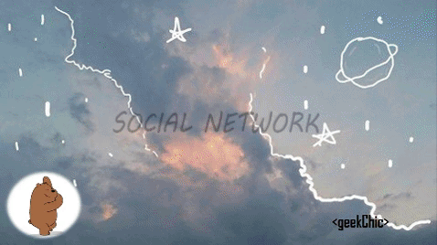
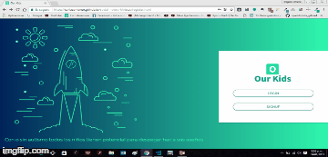
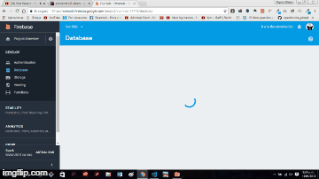

# Reto SOCIAL-NETWORK
## Objetivo
___________________________

Crear una red social sobre una problemática a elegir.

## Nombre de la red Social 
## *Our Kids*
_________________________

*Our Kids es una red social que se especializa en compartir información entre usuarios, que están a cargo de niños con autismo, para que asi puedan ayudar a las personas que tienen el mismo problema que tuvieron ellos y pudieron hallar una solución efectiva.*

## Especificaciones de Desarrollo

* La página principal es denominada `index.html` en el cual se encuentra al vista splash solicitada  y se enlaza las hojas de estilos propias y la de Materialize.

* En la carpeta `css` se encuentra el archivo `main.css` y `home.css` donde se han agregado los  estilos necesarios para el proyecto.

* En la carpeta `vendors` se encuentran los archivos de Materialize y jquery.

* En la carpeta `js` se encuentran los archivos jquery por cada vista desarrollada.

* En la carpeta `views` se encuentran las diferentes vistas del proyecto.

* En la carpeta `assets` se encuentra la carpeta `images` donde estan las imágenes necesarias para el proyecto.

* Esta web utiliza 1 tipografía :   `Roboto`.

* La paleta de colores se basa en estos tres : `#00bfa5` y   `#FFFFF`.

* Los íconos se obtuvieron de  Materialize.

* En el desarrollo del proyecto se han utilizado diferentes tipos de efectos sobre algunos títulos e imágenes, todo esto especificado en la hoja de estilos main.css.

## Recursos usados:
________________________________

* Materialize.
* Firebase.
* Jequery.
* Trello(https://trello.com/b/ZiymCmVP/our-kids)

## Versión desktop!

## Versión mobile!

## Firebase!!!

Realizado por Carla Centeno Ramos y Dayam LLerena Castro.
