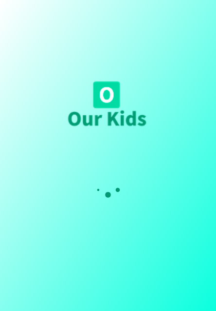
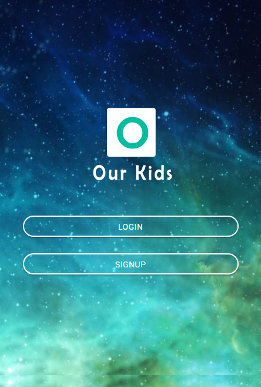
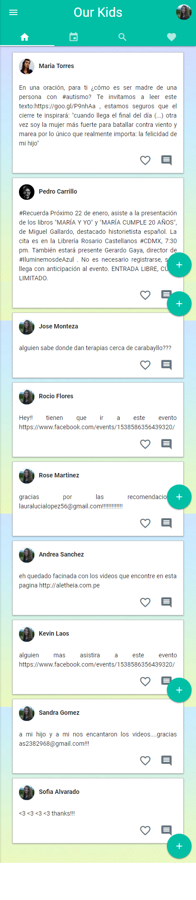
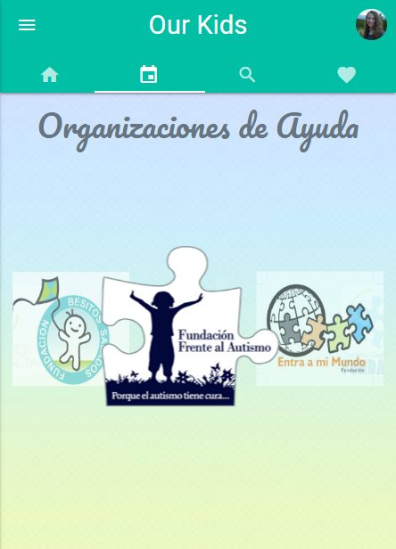
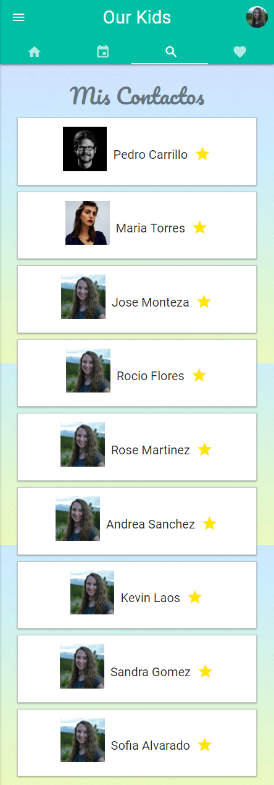
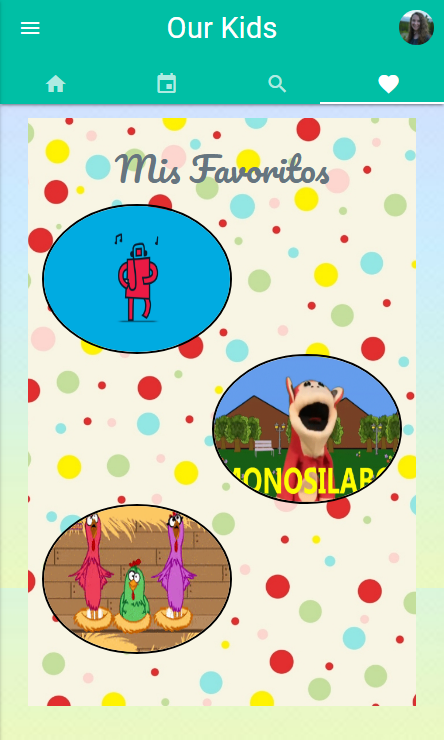
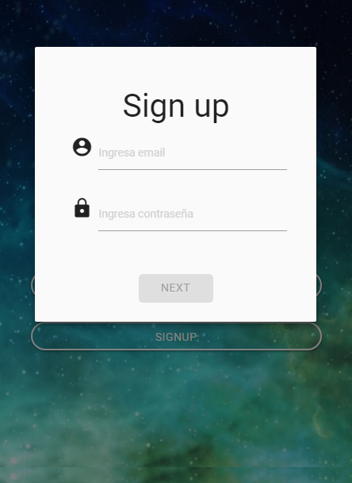
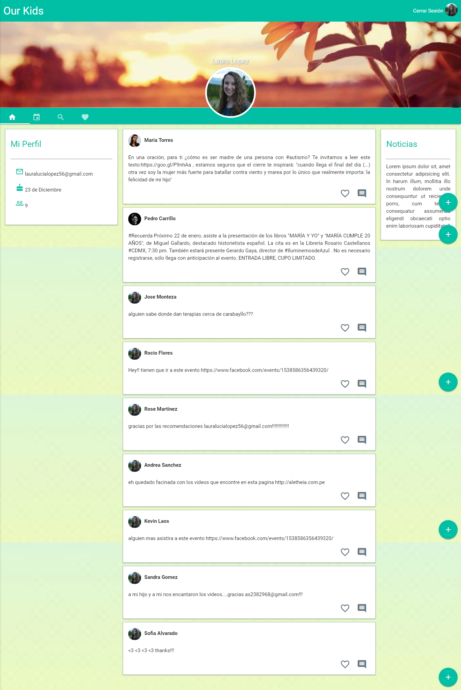
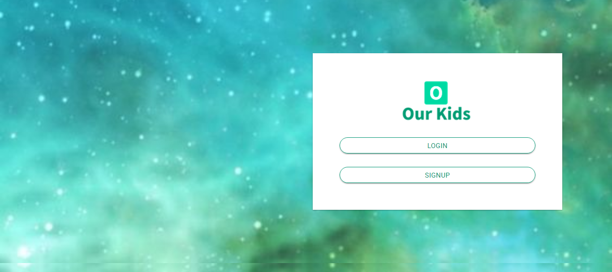
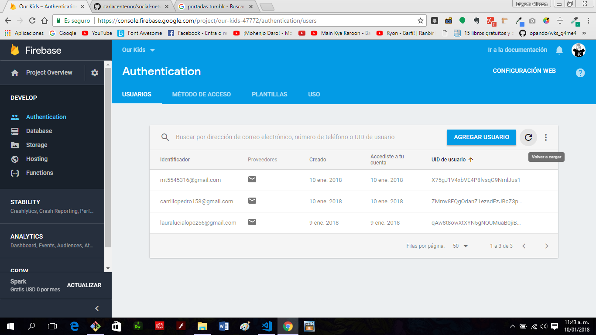

# Reto SOCIAL-NETWORK
---
## Objetivo

Crear una red social sobre una problemática a elegir.

## Usuarios Validados
*  lauralucialopez56@gmail.com / password :laura12345

* carrillopedro158@gmail.com /password :pedro12345;

* mt5545316@gmail.com / password :mariat123

## Nombre de la red Social 
Our Kids

## Especificaciones de Desarrollo

* La página principal es denominada `index.html` en el cual se encuentra al vista splash solicitada  y se enlaza las hojas de estilos propias y la de Materialize.

* En la carpeta `css` se encuentra el archivo `main.css` y `home.css` donde se han agregado los  estilos necesarios para el proyecto.

* En la carpeta `vendors` se encuentran los archivos de Materialize y jquery.

* En la carpeta `js` se encuentran los archivos jquery por cada vista desarrollada.

* En la carpeta `views` se encuentran las diferentes vistas del proyecto.

* En la carpeta `assets` se encuentra la carpeta `images` donde estan las imágenes necesarias para el proyecto.

* Esta web utiliza 1 tipografía :   `Roboto`.

* La paleta de colores se basa en estos tres : `#00bfa5` y   `#FFFFF`.

* Los íconos se obtuvieron de  Materialize.

* En el desarrollo del proyecto se han utilizado diferentes tipos de efectos sobre algunos títulos e imágenes, todo esto especificado en la hoja de estilos main.css.

## Versión Mobile

#### Vista Splash

#### Vista 1

#### Vista 2

#### Vista 3

#### Vista 4

#### Vista 5

#### Vista 6

## Versión desktop

## Autenticación con firebase

Realizado por Carla Centeno Ramos y Dayam LLerena Castro.
